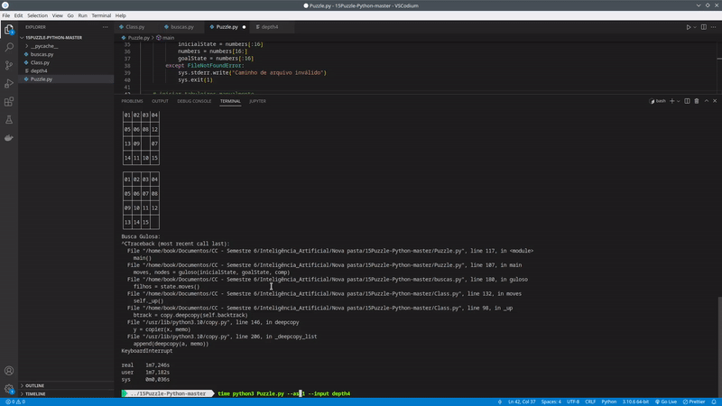
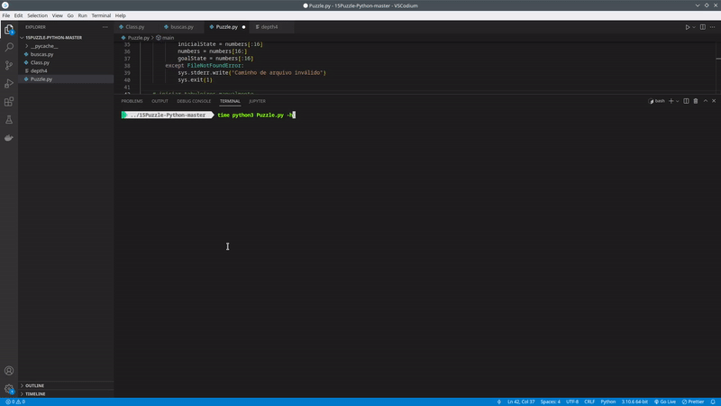

# 
Puzzle 15

 

  
  

#### Descrição do Problema

O jogo do 15 trata-se de um quebra-cabeças de quinze peças, composto por uma placa oca de metal com quinze quadrados que trocam de lugar, todos gravados com números, letras ou figuras. Tendo como objetivo, ordenar os quadrados, da esquerda para a direita e de cima para baixo, isto é, obter a disposição original dos contadores depois de terem sido aleatoriamente deslocados.

#### Estrutura de Dados Utilizada
Para resolver o problema, utilizamos as seguintes estruturas de dados:
- Busca em Largura
- Busca em profundidade
- A*
- Busca Gulosa

#### Execução do programa
- A*

- Busca em Largura (BFS)

